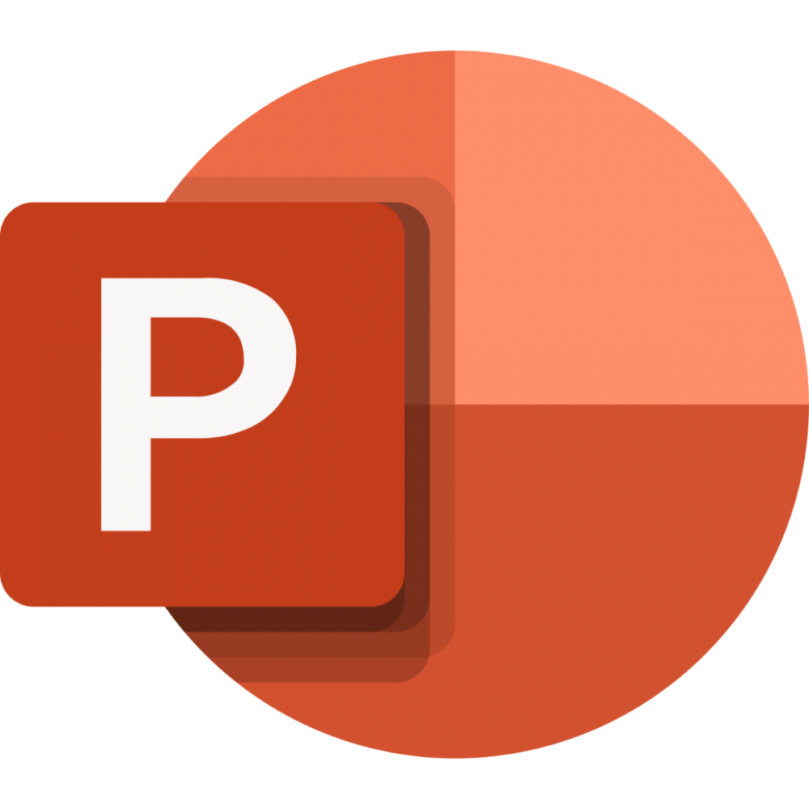

# Hi there, I'm Aditya Kakde 👋 

## I'm an Analyst and a Researcher!!

- 🔭 I am currently working on analytics projects.
- 🌱 I’m currently learning analytics stuff.
- 👯 I’m looking to collaborate with industry experts.
- 📫 How to reach me: @Onnamission
- ⚡ Fun fact: I love to play games.

### Languages and Tools:

